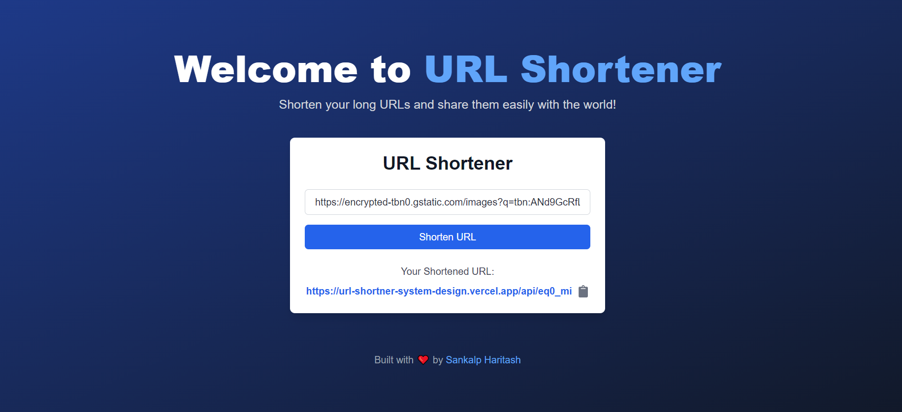

## LinkLite

## Quickly shorten URLs, track links, and share effortlessly with LinkLite.

A simple and efficient URL shortener built using Next.js and TypeScript. The application allows users to generate shortened URLs, copy them to the clipboard, and improve link sharing. The app is responsive, easy to use, and provides additional features like keyboard shortcuts for better accessibility.



## Features

- Generate shortened URLs from long URLs.
- Keyboard shortcut (CTRL + K) to focus on the input field.
- Copy the shortened URL to the clipboard with a single click.
- Visual feedback for successful copying.
- Modern and responsive user interface designed with Tailwind CSS.

## Installation

1. Clone the repository:

   ```
   git clone https://github.com/your-username/url-shortener.git

   ```

2. Install dependencies:

```
npm install
```

3. Start the development server:

```
npm run dev
```

Open the app in your browser:

```
http://localhost:3000
```

4. API Endpoints
   Ensure your backend API is running and configured. By default, the app points to:

1. Production: https://url-shortner-system-design.vercel.app
1. Development: http://localhost:3000

API Endpoint Example
POST /api/shortner

Request:

```
{
  "originalUrl": "https://example.com/very-long-url"
}
```

Response:

```
{
  "shortUrl": "https://short.ly/abcd1234"
}
```

## How to Use

1. Enter your long URL in the input field.
2. Click the "Shorten URL" button.
3. Copy the generated short URL using the clipboard icon.
4. Keyboard Shortcut Press CTRL + K to quickly focus on the input field.

# Future Improvements

Below are some suggested improvements for the app:

1. Custom Short URLs: Allow users to specify custom aliases for the shortened URL.

2. Analytics Dashboard: Track and display statistics for each short URL, such as click counts and referrers.

3. QR Code Generation: Generate a QR code for the shortened URL for easier sharing.

4. Bulk Shortening: Enable batch processing of multiple URLs.

5. Password-Protected URLs: Add password protection for sensitive links.

6. Expiration Dates: Allow users to set expiration dates for their URLs.

7. UI/UX Improvements
   Dark Mode: Add support for light and dark themes.
   Mobile Optimization: Improve usability on mobile devices with larger buttons and better spacing.

8. Error Handling: Provide detailed error messages and validations for invalid URLs.

9. Social Sharing Buttons: Allow users to share their shortened URL directly on social media.

10. Code Improvements

- State Management: Use a state management library like Redux or Zustand for better scalability.

- Testing: Add unit and integration tests using Jest and React Testing Library.
- Documentation: Enhance inline code documentation for better readability.

## Deployment Improvements

1. Docker Support: Create a Dockerfile for easy deployment.
2. CD/CI Integration: Integrate continuous deployment pipelines with GitHub Actions.
3. Authentication: Add user accounts to manage URLs and view their analytics.

# Contributing

Contributions are welcome! Feel free to open issues or submit pull requests to improve the project.

1. **Tech Stack Section**:
   Add a section listing the technologies used:

   - React.js
   - TypeScript
   - Tailwind CSS
   - Axios

2. **How It Works**:
   Provide a diagram or detailed explanation of how the app processes and generates shortened URLs.

3. **Contributors Section**:
   List contributors and their GitHub profiles.

4. **Issues and Feedback**:
   Add a section explaining how users can report bugs or suggest features (e.g., linking to GitHub Issues).

5. **Deployment Guide**:
   Provide step-by-step instructions for deploying the app on platforms like Vercel, Netlify, or AWS.
